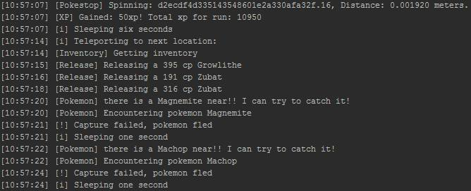
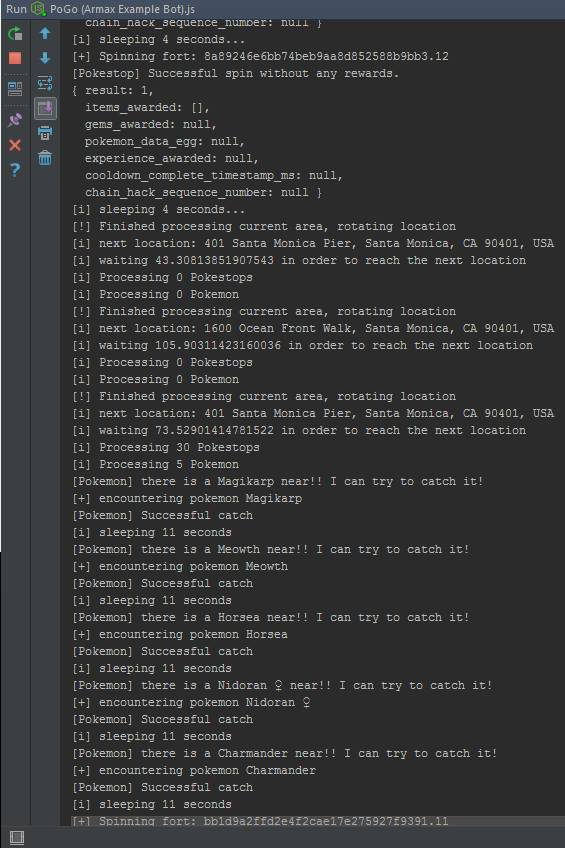
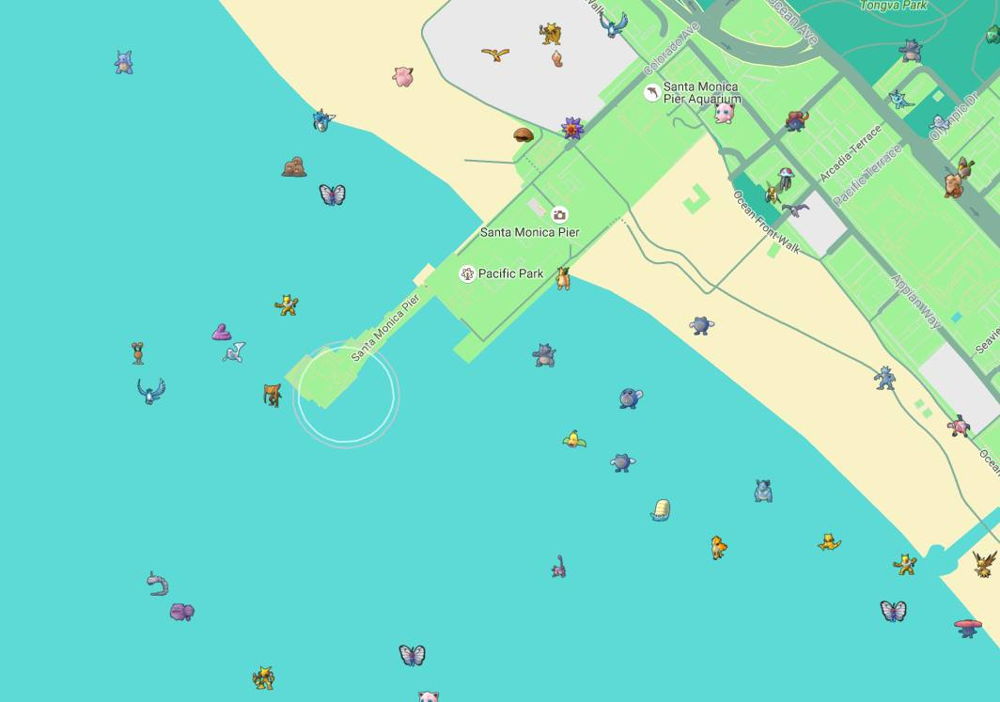


**Warning!** It has been eight years since I've touched this. The code
does not accurately reflect my current abilities. Only explaining what I did for
posterity's sake.




## Introduction

Pokemon GO was released in the summer of 2016, and was an instant hit. It sounds
comical now, but people were walking onto freeways in order to try to collect
rare Pokemon. The base game was fun enough. Walk around, spin PokeStops for
items, and collect Pokemon with the balls you got from PokeStop. At that point,
I don't even think they had the battle mechanic worked out yet. It was a
collector's game.

My interest in the game was how far I could automate it. And, before I
inevitably got banned, I made it pretty far. Thankfully, I was able to spend a
few months working on this and learned quite a lot before that happened.
I finished a text-based version, and also made good work on a visual client.
Below, I will detail the two versions, and then go into what it taught me.

## First Attempt: PoGo Purple

Like how Pokemon games are named after colors, I named my two different editions
based on colors as well. The first one I did was PoGo Purple. This was a
text-based version. This was mostly me trying to get my head around async
programming and the Pokemon GO api I was using.

### Setup

I had researched various Pokemon GO scripting client libraries. I had found a
Node.js one that looked to be easiest to use and had the most features. I
remember there being some concern about which were going to trip up the
anti-botting algorithms, but this seemed like it was not running into the same
problems others were complaining about. Unfortunately, they seemed to let bots
stay active for a little while after flagging them and then performing a mass
ban. I was able to stay active through a few rounds.

I was using WebStorm at the time as my IDE. I believe I just had the defaults
without any project-specific configuration files. This was before the tooling
really became mature for something like that.

### Implementation

With that library loaded globally via npm, I was working on a single-file script
to automate the main gameplay loop:
- Navigate to different lat/long coordinates in the game.
- Check for nearby pokemon, navigate to them if necessary, and catch.
- If the pokemon were under a specific toughness score, discard.
- Go to PokeStops for items.

### What I Learned

Obviously there is a lot in the script that I would do differently, but this was
a project I cut my teeth on trying to figure out how async/await worked and
weighing the benefits of that versus callbacks. Callback hell is real, and it is
clear I was trying to follow a callback-style architecture without going
overboard. I believe that I had a choice of a few different libraries, and this
one used callbacks. If I am remembering correctly, I chose this because it was
easier to understand. Functions are clear enough. Knowing that a callback will
be called on success or failure and passed different arguments that will
represent either the success state or failure is simple enough.

I learned how to make my own logging structure. I believe I also at some point
took it to the next level and had it logging to a file. This also led me down a
rabbit hole of logging libraries and reading up on how they differentiate
themselves.

I learned about [callback hell](https://callbackhell.com). I was keeping track
of state in global variables which were being modified by these callbacks that
could, in theory, run asynchronously. Looking back now, it's surprising it
worked as well as it did. I think my saving grace was that I had sectioned my
code so that these callbacks were never reading/writing to the same variables in
a way that would interfere with each other.

I learned about how Pokemon GO handles nearness to objects using S2 cells and
how it is factored into whether or not the player is within range of objects on
the map. This was a difficult one. I believe I had tried to write something by
hand that would be able to account for this, and then landed on teleporting
directly on top of objects. Obviously this is not a smart thing to do as users
would generally get just close enough before attempting to interact with an
object.

### Output

This shows off a few things:
- My logging structure I was very proud of. Made these much easier to read than
  some of the examples I saw of other people's scripts.
- Us visiting a PokeStop to get items/xp.
- Us moving to a new location using a sleep that was configured to be shorter or
  longer depending on how far away we were teleporting.
- Attempting to capture Pokemon.
- Releasing Pokemon that were lower than the IV (toughness) score that was set.

This sample is more of the same, just more of it. We were successful in
capturing some Pokemon, and we teleported to a few different locations.

## Second Attempt: PoGo Red

This second attempt was a rewrite of the first that focused on adding a
web-based UI frontend. Instead of monitoring server logs, the user could
navigate to a page and see on a PokeMon GO-themed Google map with multiple bot
accounts displayed, Pokemon, PokeStops. The idea was that these bot accounts
could also be managed through the UI in real time.

I got a lot of inspiration from websites that would scrape Pokemon GO locations
and show which Pokemon were present. These Pokemon radars were pretty famous at
the time, and it was a constant battle trying to keep them up and not getting
the bot accounts banned that were attempting to do this.

### Setup

Setup for this was mostly the same as the first. I had not yet gotten really
into configurations or tooling that would have helped me maintain this project
aside from using Git for versioning.

I believe I was still able to use a lot of the defaults for the web server as
WebStorm will serve the website at a localhost port for you if you run the
process.

Unfortunately, this project was also single-file. It's clear looking at the code
that it would have really benefited from being refactored.

### Implementation

Using Node.js still, I created a server backend with an web app that would serve
the UI. I was using Google maps with a custom theme to mirror the map in the
game for both day and night. Using websockets to pass data, the state of the
player/Pokemon/etc. are kept in variables on both sides.

I had not hooked up the server to actually log into the game, I had just gotten
to getting the map in order with Pokemon showing when I was banned. Looking
through the code, it appears that I had gotten the structure in place to do so
without actually adding that code when it happened.

### What I Learned

Looking back, this is really cool to see. I had played around with quite a few
things:
- Server/client programming. It is clear that the handshakes were happening for
  sending data from the server to the client. It's mock data, but it's all
  hooked up and functioning as expected.
- I used websockets in order to send data. I believe this was probably easier
  than doing Ajax requests anyway, but still happy to see it.

### Output

This shows what the client sees with mock data. You can see the player's bubble
on the Santa Monica pier with randomly placed Pokemon all around.

## Conclusion

As frustrating as it was to be banned while working on this, I thankfully had
enough time to learn a lot from the experience. I believe that doing callbacks
in this way gave me a further appreciation for async/await once I got the hang
of that.

These types of projects are also frustrating because it is hard to show a
working example of the process running because game automation is such a
moving target. I am grateful that I planned ahead and took screenshots of the
output while I was working.

In the end, very glad I took the time to do this. For the skill level that I was
at the time, I think it was a great project to attempt.

